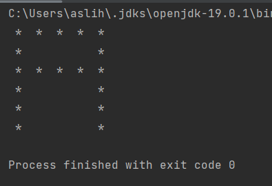
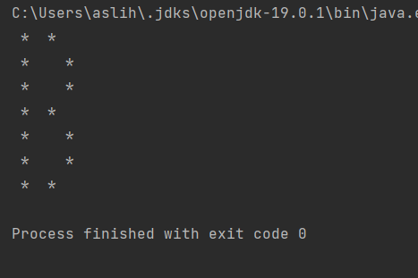

# Letter printng

### This program prints stars as letter A and letter B.

---

## Details
* This repository has
    * a LetterA.java class in which the program prints the stars as
a letter A.
      *  Program output will be as:

      
  
    * a LetterB.java class in which the program prints the stars as
      a letter B.
      *  Program output will be as:
      
      

---

## Installation
Clone the project.
> https://github.com/miyendisa/print-letter.git

---

## Usage
After cloning the project, open it with the ide you used.

---

## Requirements
* JDK (version 19 is recommended)

---

## Author
**Aslıhan Hasar**

* GitHub: [miyendisa](https://github.com/miyendisa)
* LinkedIn: [aslıhanhasar](https://www.linkedin.com/in/asl%C4%B1hanhasar
  )
---

## Contributing
Contributions, issues, and feature requests are welcome.

---

## License

[MIT](https://choosealicense.com/licenses/mit/)

---

## Show Your Suport
Give me a &#11088; if you like the project.

---

## Acknowledgments
* This repo is created for my homeworks on www.patika.dev.
